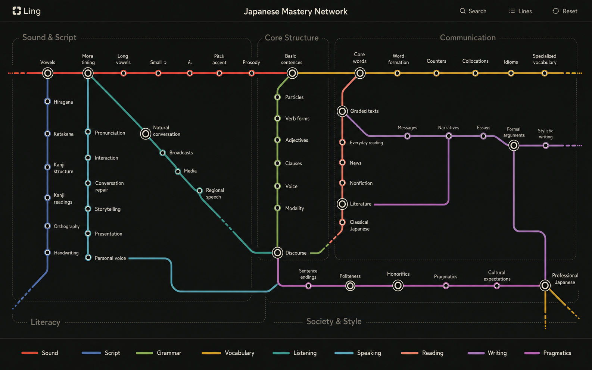

# Vision

Ling is a personal language-learning application built around one learner. Its purpose is to help that learner explore and deepen mastery of a language through an open-ended mastery network. It starts with Japanese and may support other languages as real learning needs emerge. It is not a SaaS product and should not accumulate features for hypothetical users.

## Mastery Network

Ling presents Japanese as an open-ended mastery network. Lines represent linguistic systems, stations represent learnable places, and interchanges reveal concepts shared across systems. Ling may suggest where to explore next, but it never imposes a required route or defines a final destination. Mastery grows through exploring, revisiting, and deepening understanding throughout the network.



_Conceptual visual reference. The network model and visual grammar are intentional. Specific lines, stations, colors, and topology remain provisional._

The network describes the language itself, not a course-completion ladder. These terms form its vocabulary:

| Term | Meaning |
| --- | --- |
| Network | The language territory currently mapped in Ling. |
| Region | A broad territory of related language knowledge. |
| Line | A coherent linguistic system that connects related concepts. |
| Station | A learnable place that can be entered, explored, tested, and revisited. |
| Interchange | One station shared by multiple lines. |
| Connection | A meaningful linguistic relationship between stations. |
| Station interior | The teaching, examples, drills, and tests within a station. |
| Suggestion | Optional guidance toward a useful next visit. |
| Exploration | The learner's movement across and within the network. |

## Network Invariants

- The language has no final destination, and the network has no final station.
- No single line represents total mastery.
- Suggested order is always optional.
- Stations name learnable concepts or places, not learning activities.
- Teaching, drilling, and testing happen inside stations.
- Every connection expresses a meaningful linguistic relationship.
- An interchange is one concept belonging to multiple lines, not duplicated content.
- The whole mapped network remains browsable.
- The network grows from real study needs, one useful addition at a time.
- Existing geography stays stable when possible so the learner can build a mental map.
- Revisiting a station can reveal greater depth and demand stronger evidence.
- The visible network represents the language, not a progress score.

Suggestions may quietly use prior evidence to direct attention, but they are an overlay on the network rather than a locked route through it.

## Network Visual Grammar

- A single-line station uses that line's color on its outer ring.
- An interchange shared by multiple visible lines uses a larger neutral white outer ring.
- Every station keeps a white inner ring as the common affordance for an enterable place.
- Importance, lesson availability, selection, hover, and learning state do not change the structural ring treatment.
- A line ending at a station communicates the current endpoint; do not add speculative continuation.
- A station interior uses a text-free locator glyph that shows one current stop and only its local line topology.
- Activating a station locator returns to the network with that same station focused.

## Learning Contract

- Build from real study needs, one useful increment at a time.
- Pursue mastery through teaching, active recall, correction, and retesting.
- Present Japanese through Japanese writing and sound; never use romaji.
- Treat replayable pronunciation and concise linguistic insight as core learning material.
- Prefer direct testing over passive lesson consumption.
- Let the learner browse and test any mapped territory.
- Make every station independently teachable and testable.
- Keep scheduling and learning state quiet and instrumental when they become necessary.
- Do not add streaks, scores, progress meters, badges, or other gamification.
- Generalize for another language only after its real requirements are known.

## Mastery Evidence

A station may ask for different forms of evidence, as relevant:

- Perceive the concept clearly in sound or writing.
- Explain the relevant linguistic distinction.
- Recognize it without supporting cues.
- Recall it before seeing the answer.
- Produce it accurately.
- Use it within a broader capability.
- Retain it after time has passed.

Mastery is evidence across modalities, contexts, and time. A successful visit does not permanently complete a station; it changes what depth is useful to explore next.

## Current Seed Network

The current mapped network has two lines and six stations:

```text
Speech              Vowels ───────── Mora timing
                      │
Kana                  │
                      │
                  Hiragana
                      │
                  Katakana
                      │
                 Dakuten & Handakuten
                      │
               Yōon
```

`Vowels` is the starting station. It introduces Kana through Hiragana and Katakana as two ways to write the same sounds, beginning with the five Japanese vowels:

```text
あ / ア  い / イ  う / ウ  え / エ  お / オ
```

The chart places Hiragana and Katakana in separate rows beneath the same five sounds. Each Kana opens a flashcard with its pronunciation, a playable Japanese example word, and a translation.

This seed is a valid piece of the eventual network, not a disposable prototype. The visible network represents where the learner has traveled: it begins with `Vowels` alone, reveals the Kana segment to `Hiragana` after the learner explores Vowels, extends to `Katakana` after Hiragana is known, then reaches `Dakuten & Handakuten` and `Yōon` in sequence as each preceding station is completed. Completing Yōon reveals `Mora timing` on the Speech line. Future stations and connecting segments stay hidden until their prerequisites are complete. Do not use faint or inactive geography, and add no line segments for speculative stations.

## Current Station Interiors

`Vowels` provides the orientation needed before either Kana system is studied in full. It defines Kana, explains the different roles of Hiragana and Katakana, and introduces their five shared vowel sounds in one chart. Each of the ten Kana opens a flashcard with bundled pronunciation, a playable example, and a translation.

`Hiragana` presents the complete 46-character basic chart under five approximate English vowel-sound headings. Every Kana opens a flashcard that reveals its pronunciation and translation alongside a playable Japanese example. Self-reported knowledge is saved privately and reflected in the chart and station progress ring.

`Katakana` introduces why Japanese uses a second Kana system, then presents the same 46 basic sounds with the same chart and flashcard interaction as Hiragana. Its examples emphasize the borrowed words and foreign names for which Katakana is commonly used.

`Dakuten & Handakuten` teaches the two marks that change familiar Kana sounds. Enlarged mark forms lead into one complete five-column chart of marked Hiragana and Katakana. Every distinct chart entry opens a flashcard with pronunciation, a playable example, a translation, and private self-reported progress.

`Yōon` teaches how small `ゃ`, `ゅ`, and `ょ` and their Katakana matches join the Kana before them to make one sound. One complete three-column chart keeps every Hiragana and Katakana combination visible, and every entry opens the same flashcard and private progress interaction used by the preceding Kana stations.

`Mora timing` first defines a mora as one rhythmic timing unit, then presents playable words with plain inline beat divisions. It teaches small `っ` and `ッ` as a held beat and the Katakana long-vowel mark `ー` as an added beat. Audible Kana units are independently playable; silent timing marks remain visible in the beat division. The station remains hidden until Yōon is complete.

All pronunciation is bundled synthetic speech played at its authored speed. Stations record no score. Kana chart and extension tests record only the learner's self-reported knowledge and show it through restrained progress rings on the chart and study rows.

## Not Yet

The complete Japanese network, final line taxonomy, exact topology and colors, generic graph infrastructure, automated recommendations or routing, deck management, automated scheduling, speech evaluation, content-management tooling, metrics, and a generic multilingual model wait until direct use demonstrates the need.
