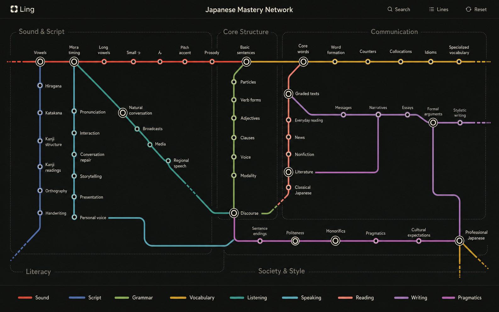

# Vision

Ling is a personal language-learning application built around one learner. Its purpose is to help that learner explore and deepen mastery of a language through an open-ended mastery network. It starts with Japanese and may support other languages as real learning needs emerge. It is not a SaaS product and should not accumulate features for hypothetical users.

## Mastery Network

Ling presents Japanese as an open-ended mastery network. Lines represent linguistic systems, stations represent learnable places, and interchanges reveal concepts shared across systems. Ling may suggest where to explore next, but it never imposes a required route or defines a final destination. Mastery grows through exploring, revisiting, and deepening understanding throughout the network.



_Conceptual visual reference. The network model and visual grammar are intentional. Specific lines, stations, colors, and topology remain provisional._

The network describes the language itself, not a course-completion ladder. These terms form its vocabulary:

| Term | Meaning |
| --- | --- |
| Network | The language territory currently mapped in Ling. |
| Region | A broad territory of related language knowledge. |
| Line | A coherent linguistic system that connects related concepts. |
| Station | A learnable place that can be entered, explored, tested, and revisited. |
| Interchange | One station shared by multiple lines. |
| Connection | A meaningful linguistic relationship between stations. |
| Station interior | The teaching, examples, drills, and tests within a station. |
| Suggestion | Optional guidance toward a useful next visit. |
| Exploration | The learner's movement across and within the network. |

## Network Invariants

- The language has no final destination, and the network has no final station.
- No single line represents total mastery.
- Suggested order is always optional.
- Stations name learnable concepts or places, not learning activities.
- Teaching, drilling, and testing happen inside stations.
- Every connection expresses a meaningful linguistic relationship.
- An interchange is one concept belonging to multiple lines, not duplicated content.
- The whole mapped network remains browsable.
- The network grows from real study needs, one useful addition at a time.
- Existing geography stays stable when possible so the learner can build a mental map.
- Revisiting a station can reveal greater depth and demand stronger evidence.
- The visible network represents the language, not a progress score.

Suggestions may quietly use prior evidence to direct attention, but they are an overlay on the network rather than a locked route through it.

## Network Visual Grammar

- A named vertical spine organizes a broad level of knowledge; the first spine is Foundations.
- Moving down a spine reveals the major territories as category stations within that level in a useful conceptual order.
- Moving right along a territory represents increasing depth, not mandatory completion.
- Peer concepts fork at the same horizontal depth and use consistent rounded bends when a straight line would imply a false sequence.
- The Foundations spine is centered, neutral white, and identified by its station names rather than a separate visible line label.
- Foundations station names sit to the left of the spine; each regular-size category station uses its branch color where the colored horizontal line begins.
- A single-line station uses that line's color on its outer ring.
- An interchange shared by multiple visible lines uses a larger neutral white outer ring.
- Every station keeps a white inner ring as the common affordance for an enterable place.
- Importance, lesson availability, selection, hover, and learning state do not change the structural ring treatment.
- A line ending at a station communicates the current endpoint; do not add speculative continuation.
- A station interior uses a text-free locator glyph that shows one current stop and only its local line topology.
- Locator glyphs select from shared topology geometry and one visible segment length; stations assign line colors but never define their own coordinates.
- Activating a station locator returns to the network with that same station focused.

## Learning Contract

- Build from real study needs, one useful increment at a time.
- Pursue mastery through teaching, active recall, correction, and retesting.
- Present Japanese through Japanese writing and sound. Teach rōmaji once as a readable notation on the Foundations spine, then use compact rōmaji beneath later Japan-line phrases; do not use IPA or English respellings.
- Treat replayable pronunciation and concise linguistic insight as core learning material.
- Prefer direct testing over passive lesson consumption.
- Let the learner browse and test any mapped territory.
- Make every station independently teachable and testable.
- Keep scheduling and learning state quiet and instrumental when they become necessary.
- Do not add streaks, scores, progress meters, badges, or other gamification.
- Generalize for another language only after its real requirements are known.

## Mastery Evidence

A station may ask for different forms of evidence, as relevant:

- Perceive the concept clearly in sound or writing.
- Explain the relevant linguistic distinction.
- Recognize it without supporting cues.
- Recall it before seeing the answer.
- Produce it accurately.
- Use it within a broader capability.
- Retain it after time has passed.

Mastery is evidence across modalities, contexts, and time. A successful visit does not permanently complete a station; it changes what depth is useful to explore next.

## Current Seed Network

The current mapped network is the Foundations spine with four populated
territories and twenty stations:

```text
Japanese
   │
 Rōmaji
   │
 Japan ──────────────────┬─ Introductions
   │                     ├─ Navigation
   │                     ├─ Food
   │                     ├─ Shopping
   │                     └─ Help
   │
 Sound ─────── Vowels ────── Mora ────── Pitch
   │
 Writing ───── Kana ──────┬─ Hiragana ──┐
   │                       └─ Katakana ──┴─┬─ Dakuten & Handakuten
   │                                       └─ Yōon
   │
 Vocabulary ── Words
```

`Japanese` opens the Foundations spine. `Rōmaji` follows as an orientation
station before the spine reaches four regular category stations: Japan, Sound,
Writing, and Vocabulary. These category stations organize their horizontal
branches. Japan also provides the visitor orientation at its station interior.
The spine is an organizing axis rather than a prerequisite chain.

Japan branches to the peer reference stations `Introductions`, `Navigation`,
`Food`, `Shopping`, and `Help`. Their shared horizontal depth makes clear that
one does not need to be completed before another.

Sound moves from `Vowels` to `Mora` and `Pitch`. Writing begins at `Kana`, forks
to `Hiragana` and `Katakana`, then rejoins before the related extensions
`Dakuten & Handakuten` and `Yōon`. Vocabulary currently stops at `Words`; the
visible line does not promise Kanji, grammar, or further vocabulary groupings
before those stations have real interiors.

`Vowels` uses the five shared Japanese vowels:

```text
あ / ア  い / イ  う / ウ  え / エ  お / オ
```

The chart places Hiragana and Katakana in separate rows beneath the same five sounds. Each Kana opens a flashcard with its pronunciation, a playable Japanese example word, and a translation.

This seed is a valid piece of the eventual network, not a disposable prototype.
The entire mapped network remains visible and directly accessible. Tests and
self-reported knowledge record personal progress but never unlock, hide, or
block stations. The map may communicate useful conceptual order through its
lines and connections without requiring the learner to follow that order.
Do not use faint or inactive geography, and add no line segments for speculative
stations.

## Current Station Interiors

`Japanese` introduces `日本語`, Ling, and the network in a compact orientation.
It explains lines, stations, listening, and revisiting without imposing a
course route.

`Japan` introduces `日本`, gives a concise orientation to the country, and
frames the Japan line as a small visitor reference. Its three starter
expressions include short English sound cues so the orientation remains usable
without first completing Rōmaji.

`Rōmaji` presents the basic and combined Japanese sound charts in the same
five-column form used by Hiragana and Katakana. Each cell shows only the
Rōmaji being learned and opens the shared hidden-answer flashcard flow; reveal
plays the Japanese sound and shows its short English sound cue, while
self-reported knowledge is saved privately. Compact follow-up rows explain
doubled consonants and long vowels without introducing Kana.

`Introductions` presents independently useful, source-checked first-meeting
phrases covering a name, origin, and questions about speaking Japanese and
English.
`Introductions`, `Food`, `Shopping`, and `Help` each present eight source-checked
practical phrases; `Navigation` presents six. Every row shows Japanese, a concise English meaning, an essential
usage note only when needed, compact rōmaji, and immediate bundled audio. These
stations have a shuffled flashcard test but no score, progress, completion,
scheduling, or persistence. `Help` covers urgent assistance, illness, emergency
services, a lost passport, and finding an English speaker.

`Kana` defines the two phonetic scripts and explains the different roles of
Hiragana and Katakana. It begins the Writing territory.

`Vowels` begins Sound study with the five sounds shared by Hiragana and
Katakana. Each of the ten Kana opens a flashcard with bundled pronunciation, a
playable example, and a translation.

`Hiragana` presents the complete 46-character basic chart under five approximate English vowel-sound headings. Every Kana opens a flashcard that reveals its pronunciation and translation alongside a playable Japanese example. Self-reported knowledge is saved privately and reflected in the chart and station progress ring.

`Katakana` introduces why Japanese uses a second Kana system, then presents the same 46 basic sounds with the same chart and flashcard interaction as Hiragana. Its examples emphasize the borrowed words and foreign names for which Katakana is commonly used.

`Dakuten & Handakuten` teaches the two marks that change familiar Kana sounds. Enlarged mark forms lead into one complete five-column chart of marked Hiragana and Katakana. Every distinct chart entry opens a flashcard with pronunciation, a playable example, a translation, and private self-reported progress.

`Yōon` teaches how small `ゃ`, `ゅ`, and `ょ` and their Katakana matches join the Kana before them to make one sound. One complete three-column chart keeps every Hiragana and Katakana combination visible, and every entry opens the same flashcard and private progress interaction used by the preceding Kana stations.

`Words` establishes a small practical vocabulary for finding your way,
identifying people and things, meeting immediate needs, moving around, and
speaking about the present. It is a listening-first reference with Japanese,
canonical rōmaji, meaning, bundled audio, and an explicit flashcard review in
either the English-to-Japanese or Japanese-to-English direction.

The earlier `Nouns`, `Verbs`, and `Adjectives` stations have been retired.
Vocabulary grows through practical Words sets rather than abstract parts-of-speech
routes.

`Mora` first defines a mora as one rhythmic timing unit, then presents purpose-chosen playable examples with plain inline beat divisions. It teaches small `っ` and `ッ` as a held beat and the Katakana long-vowel mark `ー` as an added beat. Audible Kana units are independently playable; silent timing marks remain visible in the beat division.

`Pitch` introduces standard Tokyo Japanese word-pitch contours as movement between low and high morae. Concise teaching examples group contours by whether pitch stays high, falls early, or falls later. Its purpose-chosen examples play directly beside one mora-aligned contour rather than defining the starter vocabulary. Review begins with audio and a quiet listening window, then reveals the Japanese word, contour, and meaning before the learner marks it `Good` or `Not Yet`.

All pronunciation is bundled synthetic speech played at its authored speed. Stations record no score. Kana chart and extension tests record only the learner's self-reported knowledge and show it through restrained progress rings on the chart and study rows.

## Not Yet

The complete Japanese network, further Japan-line depth, a global romaji setting,
generic graph infrastructure, automated recommendations or routing, deck
management, automated scheduling, speech evaluation, content-management
tooling, metrics, and a generic multilingual model wait until direct use
demonstrates the need.
